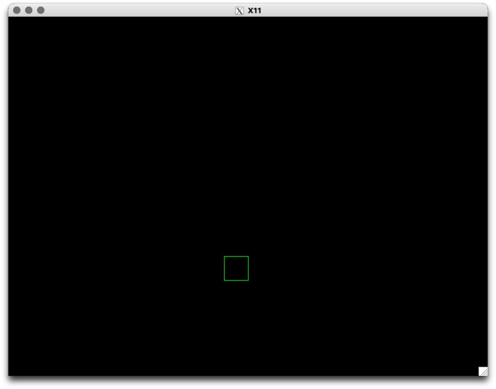

#### First try in a game engine (2d) 
- repository for 3d: https://github.com/FelixJaschul/rasterizerengineX11.git 

#### THIS IS IT:

#### TL:DR
you run it with cmake lol. Good luck
- obv only runs on LINUX (tested) or WSL (tested) and on MACOS (my setup) if XQuartz is installed (because X11 ??)
- the performance has nothing to do with the software but how trash your cpu is bla bla.
- bla bla. Windows wont be supported bla bla.
